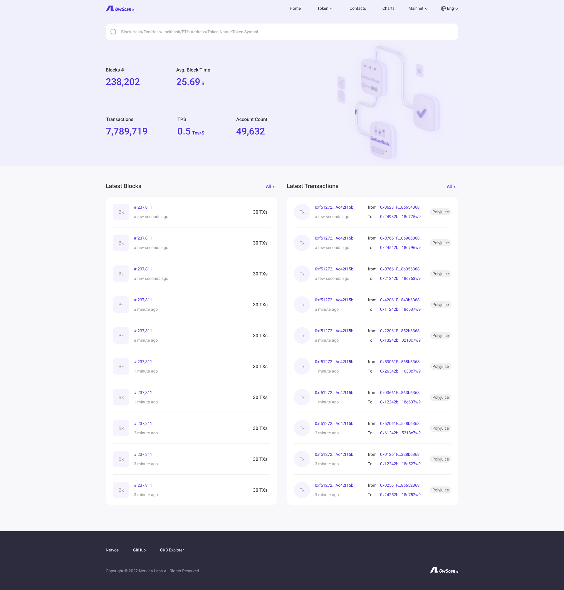
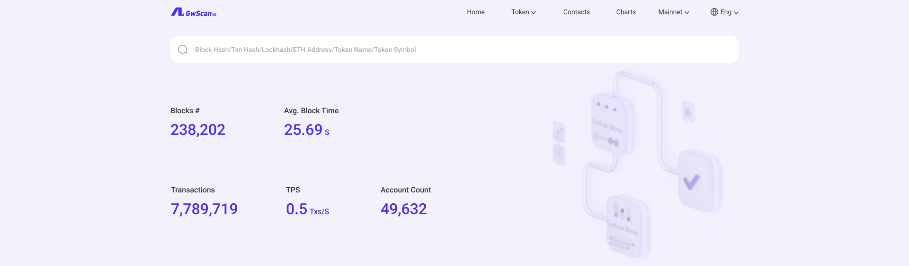
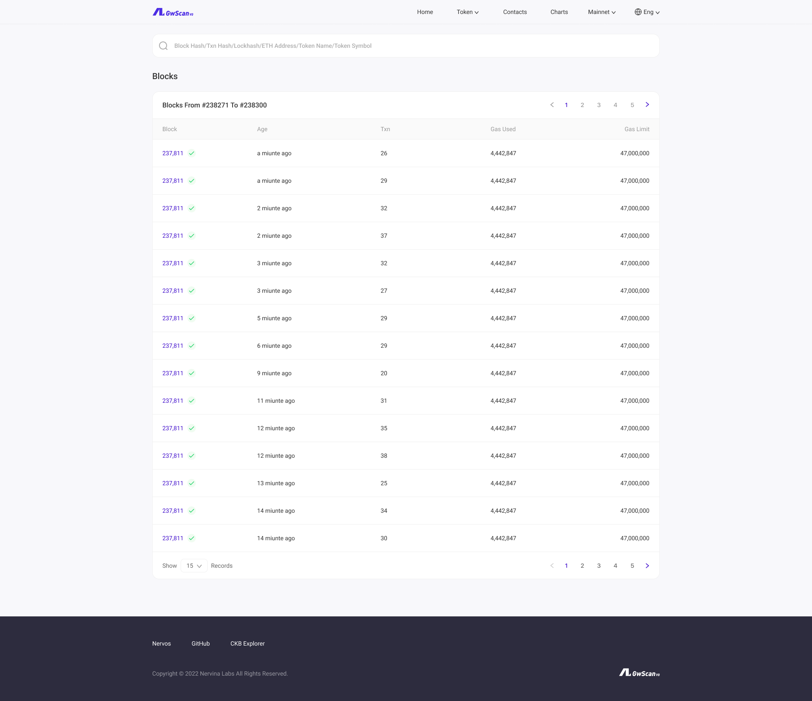

## Figma
https://www.figma.com/file/6XNoimRDbFTTNm016rbIdU/GwScan?node-id=0%3A1

## Overview

## Pages
1. Home Page: https://www.gwscan.com/
2. Block List: https://www.gwscan.com/blocks
3. Transaction List: https://www.gwscan.com/txs
4. Block Detail: https://www.gwscan.com/block/0x69a1838b1030a505823fb3a6f623a5839d16b9ab52c37cff4c1835222123035d
5. Transaction Detail: https://www.gwscan.com/tx/0x8a06ffecf0a3662aa0af9cdbb29e3529f0509f887067e6bdece560fcb74f9960
6. User Account Detail: https://www.gwscan.com/account/0x98d6fc98b3c26b9dd3b7e4bac3e11ceb3e7171da
7. Contract Account Detail: https://www.gwscan.com/account/0x297ce8d1532704f7be447bc897ab63563d60f223
8. Token List: https://www.gwscan.com/tokens/bridge
9. Token Detail: https://www.gwscan.com/token/249
10. Registered Contract List: https://www.gwscan.com/contracts
11. Registered Contract Detail: https://www.gwscan.com/account/0xd66eb642ee33837531fda61eb7ab15b15658bcab
12. Charts https://www.gwscan.com/charts
